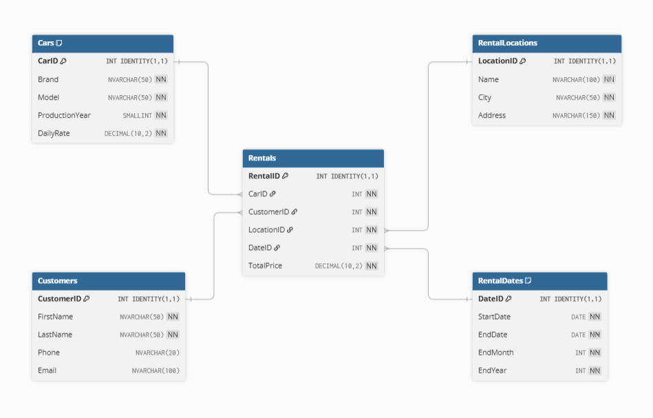

# Car Rental Database

A relational database project created in Microsoft SQL Server for a fictional car rental company.

The project focuses on database design, SQL data analysis and preparing data for visualization in Power BI.

## Project Overview

The database stores information about:

- cars available for rental,
- customers,
- rental locations,
- rental dates,
- completed rentals and their revenue.

The dataset is synthetically generated.

## Database Structure

The database consists of the following main tables:

### Cars
Stores information about vehicles available for rental, including:
- brand,
- model,
- production year,
- daily rental rate.

### Customers
Stores customer information such as:
- first name,
- last name,
- phone number,
- email address.

### RentalLocations
Contains information about locations of rentals.

### RentalDates
Stores rental date information, including:
- start date,
- end date,
- month,
- year.

### Rentals
The facts table connecting dimensions:
- cars, 
- customers,
- locations,
- dates.

## Data Model

## SQL Features

The project demonstrates the use of several SQL Server features:

- Common Table Expressions (CTEs)
- Window functions
- Moving averages
- PIVOT
- User-defined functions

## Data Analysis

The repository contains several analytical SQL queries.

### Monthly Revenue Change

Calculates monthly revenue for each year separately and compares it with the previous month using the `LAG()` window function.

### Moving Average

Calculates a moving average of monthly revenue to make revenue trends easier to analyze.

### Revenue Pivot

Uses `PIVOT` to present monthly revenue in a year/month format.

### Revenue by Brand and Year

A SQL function calculates revenue generated by a selected car brand in a selected year.

## Power BI
The Power BI model can use `Rentals` as the central fact table and the remaining tables as dimensions.

Example visualizations include:

- total revenue,
- average rental value,
- monthly revenue,
- revenue moving average,
- revenue by car brand,
- revenue by rental location,
- rental activity by year and month.

## Technologies

- Microsoft SQL Server
- SQL Server Management Studio
- Power BI

## Repository Files

`CreateTables.sql`  
Creates the database tables and relationships.

`FillTablesProcedures.sql`  
Contains stored procedures used to generate sample data.

`FillTablesExec.sql`  
Executes the procedures used to populate the database.

`DropTables.sql`  
Removes the database tables.

`MonthlyRevenueChange.sql`  
Calculates month-to-month revenue changes.

`MovingAverage.sql`  
Calculates the moving average of monthly revenue.

`RevenuePivot.sql`  
Creates a pivot table containing revenue by year and month.

`ProfitByBrandAndYearFunction.sql`  
Contains a function for calculating revenue for a selected brand and year.

## How to Run

1. Create a new database in Microsoft SQL Server.
2. Run `CreateTables.sql`.
3. Run `FillTablesProcedures.sql`.
4. Run `FillTablesExec.sql`.

## Purpose

The main purpose of this project is to practice and demonstrate skills in:

- relational database design,
- T-SQL,
- analytical SQL,
- window functions,
- data aggregation,
- Power BI data modeling and visualization.